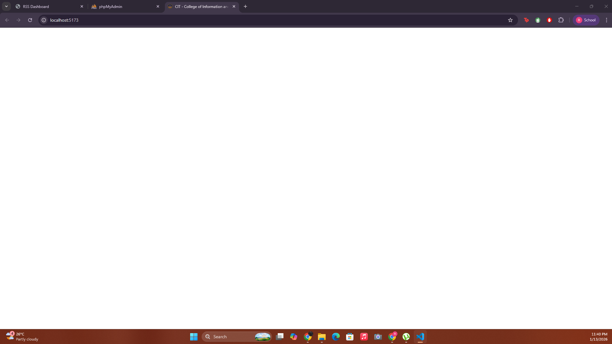

# Firebase Setup Instructions

## Step 1: Create a Firebase Project

1. Go to [Firebase Console](https://console.firebase.google.com/)
2. Click "Add project" or "Create a project"
3. Enter project name: **CIT Website** (or your preferred name)
4. Optional: Enable Google Analytics (recommended)
5. Click "Create project"

## Step 2: Register Your Web App

1. In the Firebase Console, click the **Web icon** (</>) to add a web app
2. Enter app nickname: ****
3. Check "Also set up Firebase Hosting" (optional)
4. Click "Register app"
5. **IMPORTANT:** Copy the Firebase configuration values shown

## Step 3: Configure Environment Variables

1. Open the file `.env.local` in your project root
2. Replace the placeholder values with your actual Firebase config:
   - `VITE_FIREBASE_API_KEY` - Your API key
   - `VITE_FIREBASE_AUTH_DOMAIN` - Your auth domain
   - `VITE_FIREBASE_PROJECT_ID` - Your project ID
   - `VITE_FIREBASE_STORAGE_BUCKET` - Your storage bucket
   - `VITE_FIREBASE_MESSAGING_SENDER_ID` - Your sender ID
   - `VITE_FIREBASE_APP_ID` - Your app ID

## Step 4: Enable Authentication

1. In Firebase Console, go to **Build > Authentication**
2. Click "Get started"
3. Click on "Email/Password" under Sign-in providers
4. Enable "Email/Password"
5. Click "Save"

## Step 5: Set Up Firestore Database

1. In Firebase Console, go to **Build > Firestore Database**
2. Click "Create database"
3. Choose "Start in production mode" (we'll configure rules later)
4. Select a Cloud Firestore location (choose closest to your users)
5. Click "Enable"

## Step 6: Configure Firestore Security Rules

1. In Firestore Database, click on the "Rules" tab
2. Replace the rules with the following (we'll customize later):

```
rules_version = '2';
service cloud.firestore {
  match /databases/{database}/documents {
    // Only authenticated admins can read/write
    match /{document=**} {
      allow read, write: if request.auth != null;
    }
  }
}
```

3. Click "Publish"

## Step 7: Enable Storage (Optional - for image uploads)

1. In Firebase Console, go to **Build > Storage**
2. Click "Get started"
3. Choose "Start in production mode"
4. Click "Next" and "Done"

## Step 8: Create Admin User

After completing the setup, you'll need to create your admin user. We'll handle this in the next step with the authentication system.

## Important Security Notes

- **NEVER** commit your `.env.local` file to Git (it's already in .gitignore)
- Keep your Firebase API keys secure
- Set up proper Firestore security rules for production
- Enable Firebase App Check for additional security

## Next Steps

Once you've completed these steps:
1. Restart your development server: `npm run dev`
2. We'll proceed to create the admin login interface
3. Then set up the admin dashboard for managing announcements
